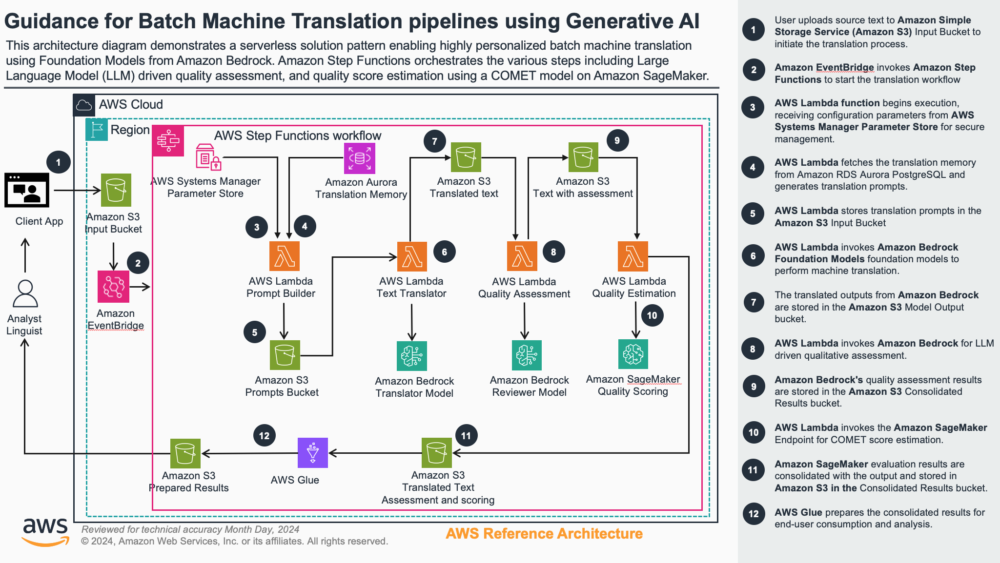

# Guidance for Machine Translation pipelines using Generative AI on AWS

## Table of Contents

### Required

1. [Overview](#overview)
    - [Cost](#cost)
2. [Prerequisites](#prerequisites)
3. [Deployment Steps](#deployment-steps)
4. [Deployment Validation](#deployment-validation)
5. [Running the Guidance](#running-the-guidance)
6. [Next Steps](#next-steps)
7. [Cleanup](#cleanup)
8. [FAQ, known issues, additional considerations, and limitations](#faq-known-issues-additional-considerations-and-limitations)
9. [Notices](#notices)
10. [Authors](#authors)


## Overview

This Guidance provides a comprehensive machine translation pipeline using Amazon Bedrock and other AWS services. It addresses the challenge of efficiently translating large volumes of text while maintaining high quality through automated quality assessment and estimation.

The solution enables organizations to:
- Process batch translations at scale
- Evaluate translation quality using AI-powered assessment
- Estimate quality metrics using specialized models
- Store translation memory for future reference and improvement



The architecture follows these key steps:
1. Upload source sentences to Amazon Simple Storage Service (Amazon S3) Input Bucket to initiate the translation process.
2. Amazon Step Functions initiates the translation pipeline orchestration workflow.
3. AWS Lambda function begins execution, receiving configuration parameters from AWS Systems Manager Parameter Store for secure management. 
4. AWS Lambda generates and stores translation prompts in the Amazon S3 Input Bucket
5. AWS Lambda invokes Amazon Bedrock Foundation Models foundation models to perform machine translation.
6. The translated outputs from Amazon Bedrock are stored in the Amazon S3 Model Output bucket.
7. AWS Lambda retrieves the translated content from Amazon S3 Model Output
8. AWS Lambda sends the translations to Amazon SageMaker Endpoint for COMET score estimation.
9. Amazon SageMaker evaluation results are consolidated with the output and stored in Amazon S3 in the Consolidated Results bucket.
10. AWS Lambda invokes Amazon Bedrock for LLM driven qualitative assessment.
11. Amazon Bedrock's quality assessment results are stored in the Amazon S3 Consolidated Results bucket.
12. AWS Glue processes the consolidated results from the Amazon S3 Evaluation Results bucket for end-user consumption and analysis.


### Cost

You are responsible for the cost of the AWS services used while running this Guidance. As of June 2025, the cost for running this Guidance with the default settings in the US East (N. Virginia) is approximately X per month for processing (Y records).

We recommend creating a [Budget](https://docs.aws.amazon.com/cost-management/latest/userguide/budgets-managing-costs.html) through [AWS Cost Explorer](https://aws.amazon.com/aws-cost-management/aws-cost-explorer/) to help manage costs. Prices are subject to change. For full details, refer to the pricing webpage for each AWS service used in this Guidance.

### Sample Cost Table

The following table provides a sample cost breakdown for deploying this Guidance with the default parameters in the US East (Ohio) Region for one request of around 200 characters.

| AWS service  | Dimensions | Cost [USD] |
| ----------- | ------------ | ------------ |
| Amazon Aurora PostGresSQL* | Aurora Serverless v2, 1 ACU per hour, Storage amount (100 GB), 1 hour usage  | $ 0.25 |
| AWS Secrets Manager | Number of secrets (2), Average duration of each secret (30 days), Number of API calls (3 per month) | $ 0.80 |
| Amazon Elastic Container Registry | Amount of data stored (1 GB per month)  | $ 0.10 |
| Amazon SageMaker (Inference) | Instance name (ml.c4.2xlarge), Number of Batch Transform jobs per month (1), Number of instances per job (1), Hour(s) per instance per job (0.5) | $ 0.24 |
| Amazon Bedrock (Nova) | 1.00 K input tokens 1.00 K output tokens | $ 0.004 |
| AWS Glue | Number of DPUs for Apache Spark job (10), Number of DPUs for Python Shell job (0.0625)  | $ 0.75 |
| AWS Lambda | Amount of ephemeral storage allocated (512 MB), Number of requests (10 requesth) | $ 0.1 |
| AWS Step Functions | State transitions per workflow (12)  | $ 0.1 |

* Please note that the Aurora database is optional and only relevant when translation memory is used. Cost will vary depending on usage and data stored

## Prerequisites

### Third-party tools

- Docker or Podman for building the SageMaker container image

### AWS account requirements

- AWS account with permissions to create and manage the following services:
  - Amazon Bedrock
  - AWS Lambda
  - Amazon S3
  - AWS Step Functions
  - Amazon Aurora PostgreSQL
  - Amazon SageMaker
  - AWS Glue
  - AWS IAM

- Amazon Bedrock model access must be enabled for the following models:
  - Amazon Nova Pro (us.amazon.nova-pro-v1:0)

### aws cdk bootstrap

This Guidance uses aws-cdk. If you are using aws-cdk for first time, please perform the below bootstrapping:

```bash
cdk bootstrap aws://ACCOUNT-NUMBER/REGION
```

Replace `ACCOUNT-NUMBER` with your AWS account number and `REGION` with your target AWS region.

### Service limits (if applicable)

- Amazon Bedrock has default quotas for API requests per second. You may need to request a quota increase for production workloads.
- AWS SageMaker has instance type limits that may require an increase for larger deployments.

### Supported Regions (if applicable)

This Guidance is best suited for regions where Amazon Bedrock and all required models are available. As of the latest update, the following regions are recommended:
- US East (N. Virginia)
- US West (Oregon)
- Europe (Frankfurt)

### Input and output buckets

The solution needs access to two S3 buckets, respectively for input and output data. You may use pre-existing buckets or create new ones. Throughout the guide we will refer to these buckets as "your-input-bucket-name" and "your-output-bucket-name".

## Deployment Steps (required)

1. Clone the repo using command 
```bash
git clone https://github.com/aws-samples/guidance-for-machine-translation-pipelines-using-amazon-bedrock.git
```

2. Navigate to the repo folder 
```bash
cd guidance-for-machine-translation-pipelines-using-amazon-bedrock
```

3. Create and activate a Python virtual environment:
```bash
python -m venv .venv
source .venv/bin/activate  # On Windows: .venv\Scripts\activate
```

4. Install the required dependencies:
```bash
pip install -r deployment/requirements.txt
```

5. Build the quality estimation image:
```bash
cd source/sagemaker/
source ./build_and_push.sh
```

6. Update the `cdk.json` context with your configuration:
```json
{
  "context": {
    "input_bucket_name": "your-input-bucket-name",
    "output_bucket_name": "your-output-bucket-name",
    "quality_estimation_sgm_model_name":"your-quality-estimation-model-name",
    "quality_estimation_sgm_endpoint_name": "your-quality-estimation-endpoint-name",
    "quality_estimation_sgm_image_uri":"your-quality-estimation-image-uri",
    "quality_estimation_sgm_topic_name":"your-quality-estimation-sgm-topic-name",
    "hugging_face_token": "your-hugging-face-token",
    "marketplace_endpoint_name": "marketplace-endpoint-name", # optional
    "config_secret_name": "workflow-bedrock-config" # optional, defaults to workflow-bedrock-config
  }
}
```

8. Navigate to the deployment directory:
```bash
cd ../../deployment
```

9. Bootstrap your AWS environment (if you haven't already):
```bash
cdk bootstrap
```

10. Synthesize the CloudFormation template:
```bash
cdk synth
```

11. Deploy the stacks:
```bash
cdk deploy --all
```

## Deployment Validation

1. Open the AWS CloudFormation console and verify that all stacks have been created successfully with a status of "CREATE_COMPLETE":
   - DatabaseStack
   - SageMakerStack
   - WorkflowStack

2. Verify the Step Functions state machine has been created:
   - Open the AWS Step Functions console
   - Look for a state machine named "BatchMachineTranslationStateMachineCDK"
   - Verify the state machine definition matches the expected workflow

3. Verify the SageMaker endpoint is active:
   - Open the Amazon SageMaker console
   - Navigate to Endpoints
   - Verify the quality estimation endpoint is "InService"

4. Run the following CLI command to validate the deployment:
```bash
aws stepfunctions describe-state-machine --state-machine-arn arn:aws:states:<region>:<account-id>:stateMachine:BatchMachineTranslationStateMachineCDK
```

## Running the Guidance

### Prepare Input Data

1. Create a CSV file with the following columns:
   - source_language: The language code of the source text
   - target_language: The language code of the target text
   - source_text: The text to be translated
   - context: (Optional) Additional context to improve translation quality

   You can find a sample file (sample_test.csv) in the sample_data folder

2. Upload the CSV file to your input S3 bucket:
```bash
aws s3 cp your-input-file.csv s3://your-input-bucket-name/inputs/your-input-file.csv
```

### Start the Translation Workflow

1. Start the Step Functions workflow with the following input:
```bash
aws stepfunctions start-execution \
  --state-machine-arn arn:aws:states:<region>:<account-id>:stateMachine:BatchMachineTranslationStateMachineCDK \
  --input '{"callerId": "user123", "inputFileKey": "inputs/your-input-file.csv"}'
```

You may also start the workflow from the console by opening the state machine configuration and clicking the Execute button.


The pipeline accepts the following input parameters:
- `callerId` (required): A unique identifier for tracking the translation job and organizing output files
- `inputFileKey` (required): The S3 object key path to your CSV input file containing the translation requests
- `inputBucket` (required): Input bucket
- `outputBucket` (required): Output bucket containing all generated files by the state machine

These parameters enable the workflow to process your data and store results in an organized manner within your output bucket.

### Lambda Function Configuration

The pipeline uses several Lambda functions with configurable environment variables:

**Prompt Generator Function:**
- `DATABASE_SECRET_ARN`: ARN of the Aurora credentials secret
- `CLUSTER_ARN`: ARN of the Aurora PostgreSQL cluster
- `DATABASE_NAME`: Name of the translation memory database
- `WORKFLOW_SECRET_ARN`: ARN of the workflow configuration secret
- `DEFAULT_SOURCE_LANG`: Default source language (default: "en")
- `DEFAULT_TARGET_LANG`: Default target language (default: "fr")
- `ENABLE_TRANSLATION_MEMORY`: Enable translation memory lookup (default: "true")

**Quality Score Estimation:**
- `SAGEMAKER_ENDPOINT_NAME`: Name of the SageMaker quality estimation endpoint
- `QUALITY_ESTIMATION_MODE`: Mode for quality estimation model hosting ("MARKETPLACE_SELF_HOSTED" or "OPEN_SOURCE_SELF_HOSTED", default: OPEN_SOURCE_SELF_HOSTED)

This guidance deploys  quality scoring model as a SageMaker self-hosted endpoint. At first runtime it downloads open source weights from HuggingFace. Please note that the open source version is intented for experimentation and testing only. For a commercial use, please refer to 

**Translation and Assessment Functions:**
- `WORKFLOW_SECRET_ARN`: ARN of the workflow configuration secret containing Bedrock model IDs and inference profiles

2. Monitor the execution in the AWS Step Functions console:
   - Navigate to the Step Functions console
   - Select the "BatchMachineTranslationStateMachineCDK" state machine
   - Find your execution and monitor its progress

### View Results

1. Once the workflow completes, the results will be available in your output S3 bucket:
```bash
aws s3 ls s3://your-output-bucket-name/user123/<execution-id>/analysis/
```

2. Download the results:
```bash
aws s3 cp s3://your-output-bucket-name/user123/<execution-id>/analysis/results.jsonl .
```

3. The results file contains:
   - Source text
   - Translated text
   - Quality assessment scores
   - Quality estimation metrics
   - Recommendations for improvement

## Translation Memory

The translation memory feature enhances translation quality by leveraging previously translated content. To enable this functionality, you need to initialize the translation memory database with sample data.

### Initialize Translation Memory Database

Follow these steps to set up and populate the translation memory database:

1. **Navigate to the database initialization notebook:**
   ```bash
   cd source/database/init_notebook/
   ```

2. **Open the Jupyter notebook using one of these options:**
   
   **Option A: Local Jupyter**
   ```bash
   jupyter notebook database_init.ipynb
   ```
   
   **Option B: Amazon SageMaker Studio**
   - Open Amazon SageMaker Studio in the AWS Console
   - Upload the `database_init.ipynb` file to your SageMaker Studio environment
   - Open the notebook and select a Python 3 kernel

3. **Follow the notebook instructions to:**
   - Install required Python dependencies
   - Load sample WMT19 French-German translation data from HuggingFace
   - Generate embeddings using Amazon Bedrock's Titan model
   - Populate the Aurora PostgreSQL database with translation pairs and embeddings
   - Test vector similarity search functionality

4. **Update database connection parameters:**
   Before running the notebook, replace the placeholder values with your actual CloudFormation output values:
   - `DatabaseSecretArn`: ARN of the Aurora credentials secret
   - `DatabaseClusterArn`: ARN of the Aurora PostgreSQL cluster
   - `DatabaseName`: Name of the translation memory database

Once initialized, the translation memory will automatically provide context to improve translation consistency for similar text segments.

**Important:** Ensure that the `ENABLE_TRANSLATION_MEMORY` environment variable is set to "true" in the Prompt Generator Lambda function to activate translation memory functionality.


## Next Steps

After deploying this Guidance, you can enhance it in the following ways:

1. **Customize Translation Models**: Experiment with different Amazon Bedrock models to find the best fit for your specific language pairs and content types.

2. **Fine-tune Quality Assessment**: Adjust the quality assessment prompts in `source/lambda/quality_assessment/prompt_template.txt` to focus on specific aspects of translation quality relevant to your use case.

3. **Integrate with Translation Memory**: Extend the database functionality to build a more robust translation memory system that can suggest translations based on previous similar content.

4. **Add Human Review Workflow**: Implement a human review step for translations that don't meet quality thresholds, using Amazon Augmented AI (A2I).

5. **Implement Domain-specific Terminology**: Create and maintain terminology databases for specific domains to ensure consistent translation of technical terms.

6. **Scale for Production**: Adjust the infrastructure for production workloads by:
   - Increasing Lambda function timeouts and memory
   - Scaling SageMaker endpoints
   - Implementing auto-scaling for Aurora PostgreSQL
   - Adding monitoring and alerting

## Cleanup

To avoid incurring future charges, follow these steps to delete all resources:

1. Empty the S3 buckets:
```bash
aws s3 rm s3://your-input-bucket-name --recursive
aws s3 rm s3://your-output-bucket-name --recursive
```

2. Delete the CDK stacks:
```bash
cd deployment
cdk destroy --all
```

3. Delete the ECR repository containing the quality estimation image:
```bash
aws ecr delete-repository --repository-name <repository-name> --force
```

## FAQ, known issues, additional considerations, and limitations

### Frequently Asked Questions

**Q: What languages are supported by this solution?**
A: The solution supports all languages available in the Amazon Bedrock models you choose to use. Amazon Nova Pro supports a wide range of languages, but performance may vary across language pairs.

**Q: How can I improve translation quality?**
A: You can improve translation quality by providing more context in your input data, fine-tuning the prompts, and using the quality assessment feedback to iteratively improve your translations.

**Q: Can this solution handle specialized terminology?**
A: Yes, you can include specialized terminology in the context field of your input data. For more robust terminology handling, consider extending the solution with a terminology database.

### Known Issues

- The quality estimation model may occasionally time out for very large batches. Consider breaking large translation jobs into smaller batches.
- Some language pairs may have lower quality scores due to limitations in the underlying models.

### Additional Considerations

- This Guidance creates an Amazon SageMaker endpoint that is billed per hour regardless of usage.
- The Aurora PostgreSQL database is provisioned as Serverless v2, which has minimum capacity units that will be billed even during idle periods.
- Consider implementing data encryption at rest and in transit for sensitive content.

For any feedback, questions, or suggestions, please use the issues tab under this repo.

## Notices

Customers are responsible for making their own independent assessment of the information in this Guidance. This Guidance: (a) is for informational purposes only, (b) represents AWS current product offerings and practices, which are subject to change without notice, and (c) does not create any commitments or assurances from AWS and its affiliates, suppliers or licensors. AWS products or services are provided "as is" without warranties, representations, or conditions of any kind, whether express or implied. AWS responsibilities and liabilities to its customers are controlled by AWS agreements, and this Guidance is not part of, nor does it modify, any agreement between AWS and its customers.

## Authors
- Narcisse Zekpa: nzzekpa@amazon.com
- Daniel Suarez: dssouto@amazon.com
- Deepika Suresh: dpsure@amazon.com